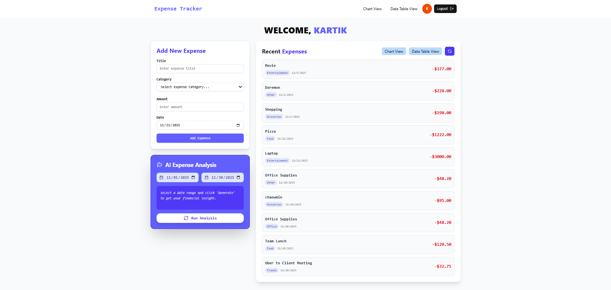
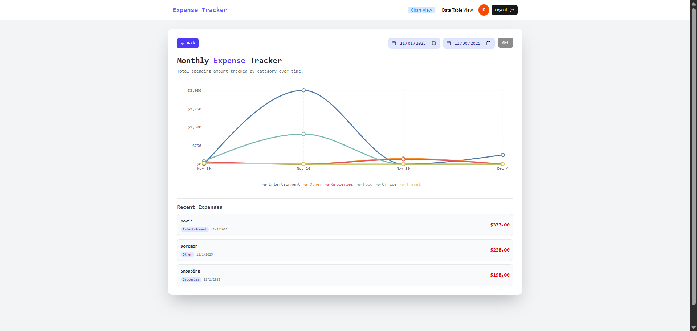
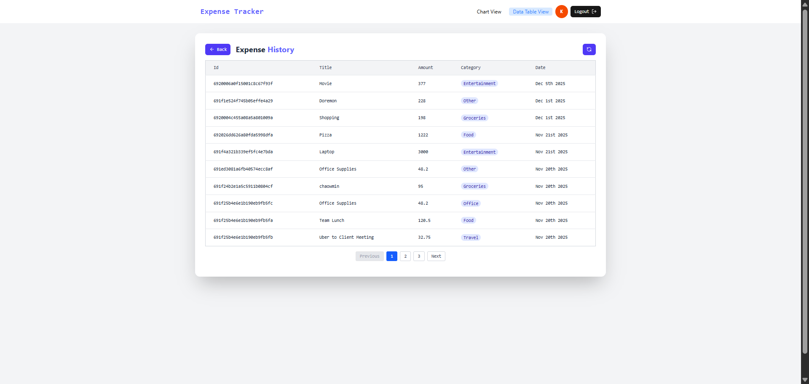

# 🏡 TENANT EXPENSE TRACKER

A full-stack application designed to help tenants **track and manage their monthly expenses** with the aid of **AI-powered summaries**.

---







## ✨ Key Features

| Feature                   | Description                                                                      |
| :------------------------ | :------------------------------------------------------------------------------- |
| **Secure Authentication** | User sign-up/login secured using **JWT** tokens stored in **HTTP-only cookies**. |
| **Expense Management**    | Easily **add, view, and filter** expenses with robust form validation.           |
| **AI Insights**           | Get an instant, AI-generated summary of spending habits based on date filters.   |
| **Data Visualization**    | Visualize spending trends through an interactive **chart view**.                 |
| **Detailed Data View**    | Browse and manage expenses in a sortable, paginated **data table**.              |

---

## 💻 Tech Stack

This project is built using a modern **MERN-adjacent stack**.

### Frontend

- **Framework:** **React**
- **State Management:** React Context
- **Styling:** Tailwind CSS

### Backend (Node.js/Express)

- **Runtime:** **Node.js**
- **Framework:** **Express.js**
- **Database:** **MongoDB**
- **Authentication:** **JSON Web Tokens (JWT)** for secure, stateless authentication.
- **Validation:** **`express-validator`** for input sanitation and validation.
- **AI Service:** Integration with a third-party AI/LLM API (e.g., OpenAI) for summary generation.

---

## 🛠️ Project Structure & Functionalities

### 🚀 Frontend (Client)

The client-side application handles user interaction and data presentation.

#### **Protected Routes (Requires Authentication)**

- **`/protected/dashboard`**
  - Presents a high-level overview of recent activity.
  - **AI Summary:** Displays the AI-generated analysis of expenses (date-filterable).
  - **Recent Expenses:** A list of the latest expense entries.
  - **Add Expense Form:** Interface with comprehensive **client-side validations**.
- **`/protected/charts`**
  - A view dedicated to the **Chart visualization** of expenses (e.g., monthly spending trends, category breakdown). Includes date/time-range filtering.
- **`/protected/table`**
  - A **Data Table View** of all expenses. Supports **sorting, filtering, and pagination** for efficient data management.

### ⚙️ Backend (API)

The RESTful API manages data persistence, security, and AI service integration.

#### **Core API Routes**

| Route Category        | Purpose                                    | Validation                            |
| :-------------------- | :----------------------------------------- | :------------------------------------ |
| **`/api/auth`**       | User registration and login.               | High-level with `express-validator`.  |
| **`/api/expenses`**   | CRUD operations for expense records.       | Detailed schema and input validation. |
| **`/api/ai-summary`** | Generates and returns the expense summary. | Validates date filters and user ID.   |

#### **Middleware**

- **Authentication Middleware:** Verifies the presence and validity of the JWT token in the cookie to protect specific routes.
- **Error Handling:** Centralized error handler for consistent API responses.

---

## ⚙️ Installation & Setup

To get a local copy up and running, follow these steps.

### Prerequisites

- Node.js
- npm or yarn
- A MongoDB database instance (Local or Atlas)
- An API key for the chosen AI Service (e.g., OpenAI)

### Backend Setup

1.  Clone the repository:
    ```bash
    cd ./backend
    ```
2.  Install dependencies:
    ```bash
    npm install
    # or yarn install
    ```
3.  Create a file named `.env` in the `backend` directory and add your environment variables:
    ```
    PORT=5000
    MONGO_URI="mongodb://localhost:27017/tenantdb" # Replace with your URI
    JWT_SECRET="YOUR_JWT_SECRET_KEY"
    GEMINI_API_KEY="YOUR_AI_SERVICE_KEY"
    ```
4.  Run the server:
    ```bash
    npm run dev
    ```

### Frontend Setup

1.  Navigate to the client directory:
    ```bash
    cd ./frontend
    ```
2.  Install dependencies:
    ```bash
    npm install
    # or yarn install
    ```
3.  Run the client:
    ```bash
    npm run dev
    ```

---
